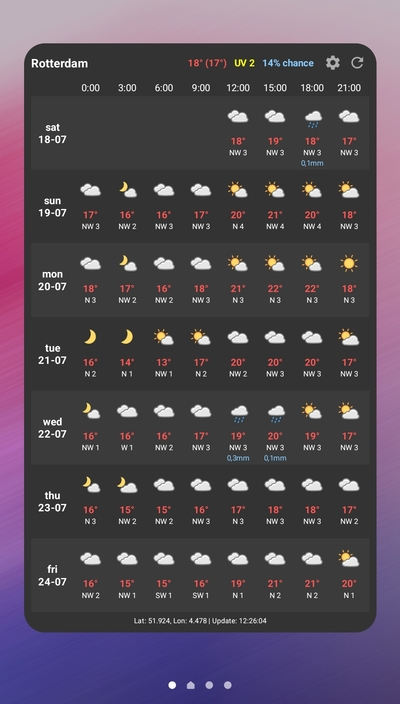
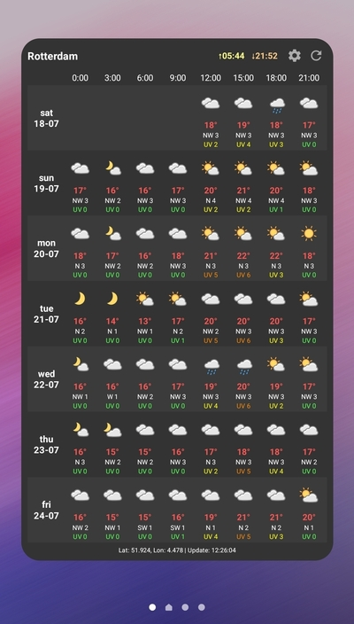
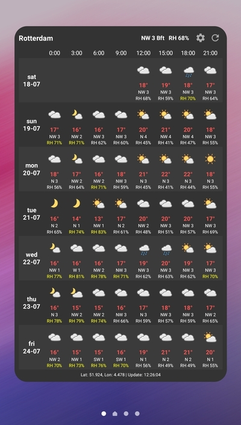
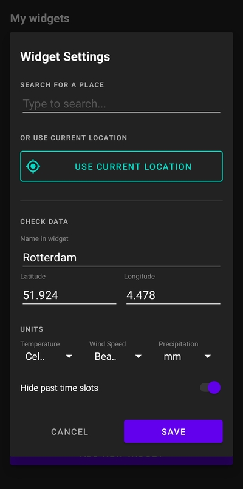

# WeatherGrid 🌦️

WeatherGrid is a clean, modern, and highly legible Android weather widget designed to give you a comprehensive 3-hour forecast grid at a single glance. No more scrolling through multiple screens just to see if you need an umbrella today.

|           Standard Mode            | Sun & UV Mode | Wind & Humidity Mode | Settings |
|:----------------------------------:|:---:|:---:|:---:|
|  |  |  |  |

## Features 🚀

- **Detailed 3-Hour Grid**: View temperature, conditions, and wind data in a compact 8-column layout.
- **Dynamic Info Toggling**: Tap the widget to cycle the header info and the grid data:
    1. **Precipitation**: Shows rain/snow amounts in the grid. Header shows Temp, UV Index, and Max Rain Probability.
    2. **Sun & UV**: Shows UV Index in the grid. Header shows Sunrise and Sunset times (localized).
    3. **Wind & Humidity**: Shows Relative Humidity (RH) in the grid. Header shows Wind (Direction + Unit) and RH.
- **Per-Widget Customization**:
    - **Hide Past Time Slots**: Keep the current day's row clean by hiding time slots that have already passed.
    - **Unit Selection**: Configure Temperature (°C/°F), Wind Speed (Bft, m/s, km/h, mph, kn), and Precipitation (mm/inch) per widget.
- **Smart Icons**: High-quality weather icons that automatically switch between day and night versions.
- **Background Updates**: Optimized hourly background updates using Android WorkManager.
- **Multi-language**: Full support for both **Dutch** and **English**.

## Visual Design 🎨

- **Modern Aesthetic**: Dark theme with vibrant color coding for temperatures and UV risks.
- **Zebra Layout**: Subtle alternating row backgrounds for maximum readability.
- **Functional Colors**: 
    - 🌡️ **Temps**: Red for above zero, blue for freezing.
    - ☀️ **UV**: Traffic-light system (Green/Yellow/Orange/Red) to indicate risk levels.
- **Custom Iconography**: Uses the clear and intuitive [Meteo-Icons](https://github.com/amedia/meteo-icons) set.

## Installation 📲

1. Download the latest `WeatherGrid-v1.1.apk` from the releases section.
2. Install it on your Android device (min SDK 32).
3. Open the app to grant location permissions.
4. Add the widget directly from the app or via your launcher's widget menu.

## Tech Stack 🛠️

- **Language**: Kotlin
- **Architecture**: Object-Oriented Manager pattern
- **Data Source**: [Open-Meteo API](https://open-meteo.com/) (No API key required!)
- **Networking**: Kotlin Serialization & URL readText
- **Background Tasks**: WorkManager
- **Location**: Google Play Services Location

## License 📄

This project is open-source. Weather icons are provided by Amedia Utvikling under CC BY-NC-SA 4.0.

---
*Created with ❤️ by Sander Baas*
