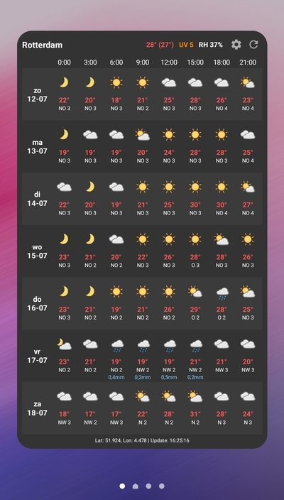

# WeatherGrid 🌦️

WeatherGrid is a clean, modern, and highly legible Android weather widget designed to give you a comprehensive 3-hour forecast grid at a single glance. No more scrolling through multiple screens just to see if you need an umbrella today.

## Features 🚀

- **Detailed 3-Hour Grid**: View temperature, conditions, and wind data in a compact 8-column layout.
- **Dynamic Info Toggling**: Tap the widget to cycle between **Precipitation**, **UV Index**, and **Relative Humidity (RH)** without reloading data.
- **Real-time Header**: Instant access to current temperature (including feels-like), UV index, and humidity right at the top.
- **Smart Icons**: High-quality weather icons that automatically switch between day and night versions based on local sun position.
- **Zebra Layout**: Subtle alternating row backgrounds for maximum readability.
- **Automatic Setup**: Adding a widget from the app automatically configures it with your current GPS location and city name.
- **Background Updates**: Optimized hourly background updates using Android WorkManager to keep your data fresh without draining the battery.
- **Multi-language**: Full support for both **Dutch** and **English**.

## Visual Design 🎨

- **Modern Aesthetic**: Dark theme with vibrant color coding for temperatures and UV risks.
- **Functional Colors**: 
    - 🌡️ **Temps**: Red for above zero, blue for freezing.
    - ☀️ **UV**: Traffic-light system (Green/Yellow/Orange/Red) to indicate risk levels.
    - 💧 **Humidity**: Highlighted in yellow when reaching extreme dry or muggy levels.
- **Custom Iconography**: Uses the beautiful and clear [Meteo-Icons](https://github.com/amedia/meteo-icons) set.

## Installation 📲

1. Download the latest `WeatherGrid-v1.0.apk` from the releases section.
2. Install it on your Android device (min SDK 32).
3. Open the app to grant location permissions.
4. Add the widget directly from the app or via your launcher's widget menu.

## Tech Stack 🛠️

- **Language**: Kotlin
- **Architecture**: MVVM / Object-Oriented Manager pattern
- **Data Source**: [Open-Meteo API](https://open-meteo.com/) (No API key required!)
- **Networking**: Retrofit & OkHttp
- **Background Tasks**: WorkManager
- **Serialization**: KotlinX Serialization
- **Location**: Google Play Services Location

## License 📄

This project is open-source. Weather icons are provided by Amedia Utvikling under CC BY-NC-SA 4.0.

---
*Created with ❤️ by Sander Baas*
